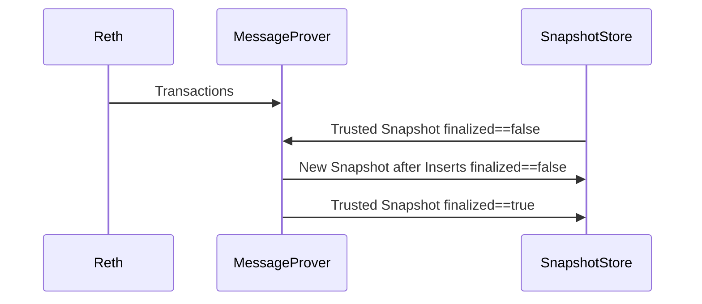

# Overview
The `ev-prover` service is a simple gRPC service designed to serve ZK proofs to clients.
It encapsulates the SP1 programs maintained under `sp1`, and uses the `sp1_sdk::ProverClient` in order to interface with them.

## Running the ev-prover service in `batch_mode` mode for a private or public testnet
The batch mode aggregates a range of blocks and proves them in one go, using a single GPU instance. This mode is better than default
when using the succinct prover network, because in default mode the base fee will accumulate and cause huge costs.

### Setup
1. Start the docker network locally
    ```shell
    make start
    ```

2. Deploy the ZKISM
    ```shell
    make deploy-ism
    ```

3. Update the ISM used by Hyperlane to the new ZKISM 
    ```shell
    make update-ism
    ```

Run the following commands from the root of the repository.

1. Install the binary to Cargo binary directory ~/.cargo/bin
    ```shell
    cargo install --path ./crates/ev-prover --features batch_mode
    ```

2. Initialize a new `ev-prover` home directory and configuration file with defaults:
    ```shell
    ev-prover init
    ```

3. Start the `ev-prover` application binary using:

    ```shell
    RUST_LOG="ev_prover=debug" ev-prover start
    ```

The service will join the tasks in `src/prover/programs/batch.rs` and `src/prover/programs/message.rs`.

## Running the ev-prover service using the `ev-exec` and `ev-range-exec` circuits
The default mode, without the `batch_mode` feature enabled, will prove every single blocks and recursively verify block proofs in a
range circuit. This is ideal for minimum latency, but expensive when running on Succinct's prover network / when paying for every prover instance
launch. 

Run the following commands from the root of the repository.

1. Install the binary to local Cargo binary directory `~/.cargo/bin`:

    ```shell
    cargo install --path ./crates/ev-prover
    ```

2. Initialise a new `ev-prover` home directory and configuration file with defaults:

    ```shell
    ev-prover init
    ```

3. Start the `ev-prover` application binary using:

    ```shell
    RUST_LOG="ev_prover=debug" ev-prover start
    ```

4. Verify the service is up and running using `grpcurl`:

    ```shell
    grpcurl -plaintext localhost:50052 list
    ```

The service will join the tasks in `src/prover/programs/range.rs`, `src/prover/programs/block.rs` and `src/prover/programs/message.rs`.

## Build system

This crate contains a custom `build.rs` that builds the SP1 programs used for proof generation.

## Protobuf

Protobuf is used as the canonical encoding format for gRPC messaging. The Protobuf definitions for the prover service are included in this crate under the `proto` directory.

The `buf` toolchain is employed to handle Rust code generation.
Please refer to the [official installation documentation](https://buf.build/docs/cli/installation/) to get setup with the `buf` CLI.

Rust code-gen is produced from the Protobuf definitions via `buf.gen.yaml` plugins and included in this crate under `src/proto`.

#### Regenerating Protobuf code

When making changes to the Protobuf definitions in `proto/prover/v1/prover.proto`, regenerate the Rust code by running:

```bash
cd crates/ev-prover/proto
buf generate
```

This will generate the prost message types and tonic server/client stubs compatible with prost 0.12 and tonic 0.10.

### Protobuf development

To update the Protobuf dependencies:

```bash
cd crates/ev-prover/proto
buf dep update
```

To lint the Protobuf definitions:

```bash
cd crates/ev-prover/proto
buf lint
```

## Hyperlane Message Finality



Finality serves two distinct purposes. Firstly, it can be used to expose the status of message proofs to the user. However the primary purpose is such that errors can be detected when the finalization status is not updated for a snapshot. Currently this will not break the system, as new messages will be proven from the next snapshot onwards, but messages could get lost until a proper retry mechanism is implemented. 

So long as the finality status of all snapshots flips to `true` there is nothing to worry about. All snapshots, except for the most recent one, should be finalized at all times. Gaps in finalization indicate that message proof submission was unsuccessful, or that the DB corrupted post submission. 

Note that the message prover always takes the last known snapshot, which is expected to be unfinalized, but no such check is enforced and generates a proof using all messages that occurred from the height of the trusted snapshot + 1 all the way to the trusted EV height in ZKISM, aka `committed_height`.