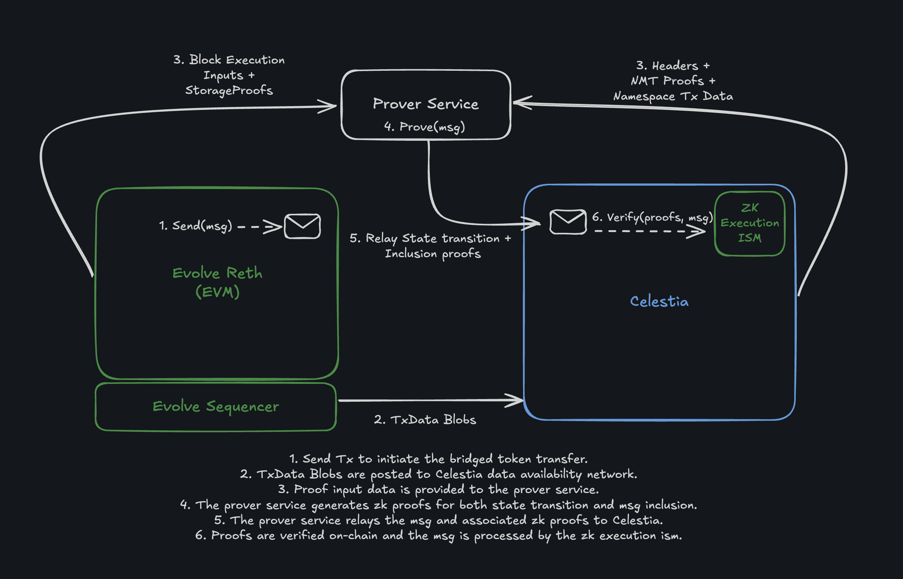
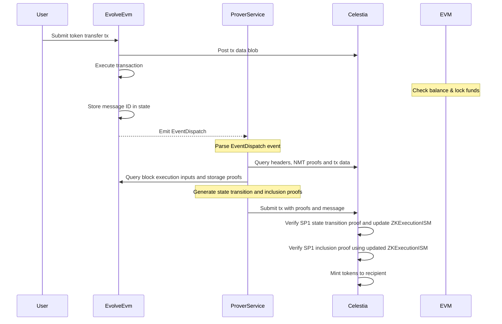

# Architecture

This document contains system architecture diagrams and high-level control flow sequences to illustrate and support understanding of end-to-end token bridging between an Evolve EVM chain and Celestia.

## EVM to Celestia token transfer flow

Below is a step-by-step sequence diagram to aid understanding of the diagram above.

1.	**Transfer message.**
The user initiates the transfer by invoking the `transferRemote` method of the TokenRouter contract through a transaction to the EvolveEvm chain. This transaction includes details like the recipient address, token amount, and the destination domain.
2.	**EvolveEvm executes the transaction.**
The EvolveEvm chain processes the transaction by checking the user’s balance and locking the funds as a collateral token. A message ID is stored in the chain state to serve as a commitment.
Subsequently, this results in a Hyperlane `EventDispatch` carrying a message payload that contains a nonce, version, origin and destination domain identifiers, and message body [see: Message reference](https://docs.hyperlane.xyz/docs/reference/developer-tools/libraries/message).
3.	**ProverService receives the event and queries for proofs.**
The prover service indexes EvolveEvm blocks for `EventDispatch` emissions. When detected, it queries the EvolveEvm chain for the stored message commitment (based on a standardised storage path). The commitment serves as proof that the origin chain has locked the funds as well as a replay-protection mechanism.
4.	**Proof generation by ProverService.**
In order for Celestia to mint synthetic tokens on behalf of the locked collateral tokens, the relayer must present two proofs:
	- A state transition proof showing the EvolveEvm chain's current state evolved from a previously known (trusted) state. This allows Celestia to trust the new state root.
	- A state inclusion proof showing that the commitment (message ID) is a valid Merkle leaf in the EvolveEvm chain state tree.
The prover service runs zk circuits built using SP1:
	- The first circuit verifies sequential EvolveEvm header-to-header state transitions using [RSP](https://github.com/succinctlabs/rsp/tree/main) and additionally proves blob inclusion in Celestia’s data availability layer. The process is repeated for a batch of Celestia blocks.
    - The second circuit verifies Merkle inclusion of the commitment (message ID).
6.	**ProverService submits proofs + message to Celestia.**
Once both proofs are ready, the prover service relays them to the on-chain verifier hosted on Celestia, along with the message to be processed.
7.	**Celestia verifies proofs and processes the message.**
Celestia decodes the proofs, verifies them using its `ZKExecutionISM` module, and authorizes the message ID to be processed. Subsequently, the associated message is processed, minting the synthetic tokens on behalf of the recipient, and the system emits a new `EventProcess` signalling its completion.

### Token return flows

If a user wishes to return tokens to the chain they originated from, the process closely mirrors the initial transfer.
Instead of locking and minting, the protocol _burns_ the synthetic tokens on the destination chain and _unlocks_ the corresponding collateral token on the origin chain.
